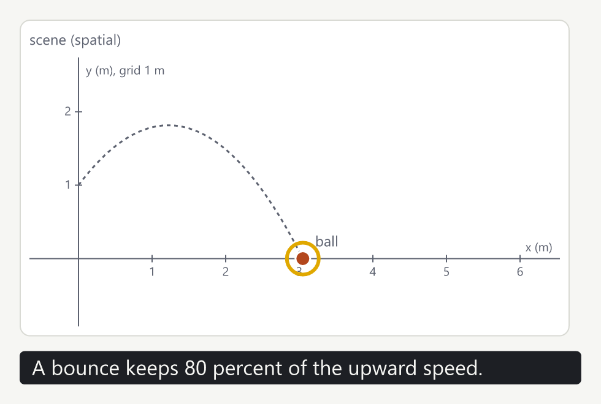

# Prismal

Prismal is a modeling language for mathematics, science and interactive systems. You describe what a system is and how it behaves (a **model**), how it is shown and what a learner may do with it (a **presentation**), and what it must do (**cases**, which are tests). Prismal checks the units, runs the model, draws it, lets a learner interact with it, plays narrated lessons, and exports images and videos.

One model, many representations: the same model can be a lab in the browser, a narrated lesson, a video, and a set of tests.



The language is young: the syntax is usable and tested, but not frozen.

## What a program looks like

```text
model Fall {
  param {
    g:  Acceleration = 9.81 m/s^2
    h0: Length       = 20 m
  }
  state {
    h: Length   = h0
    v: Velocity = 0 m/s
  }
  flow {
    der(h) = v
    der(v) = -g
  }
  event landed on falling(h)
}

presentation Watch for Fall {
  observe {
    fall_time = elapsed on landed
  }
}

run drop of Fall with Watch {
  until t0 + 5 s
  expect {
    fall_time[1] == 2.01928 s within 1e-5 s
  }
}
```

- `model` says what exists: parameters, state, how the state changes (`flow`), and events. It never says how anything is drawn.
- `presentation` says what to observe or show. Here it records the time of landing.
- `run` is a test case: it runs the model and checks the result against `sqrt(2 h0 / g)`.

Every value carries a unit and the units are checked: writing `der(h) = g` is an error, because a height cannot change at the rate of an acceleration.

## Get started

### 1. Install

Install Rust 1.94 or later from <https://rustup.rs>. Then, in this folder:

```sh
cargo test
```

Every test should pass. This also compiles and runs every program in the guide.

### 2. Run a program

Save the program above as `fall.prismal`, then:

```sh
cargo run -p prismal-web --bin prismal -- cases fall.prismal
```

Each expectation prints `pass` or `FAIL` with the reason; mistakes in the program are printed with their line and column. The command exits with an error status when a case fails, so it can run in a build.

### 3. Run the examples

The examples are the reference programs (`rp01` to `rp08`) and every program of the guide:

```sh
cargo run -p prismal-web --bin prismal -- list
cargo run -p prismal-web --bin prismal -- cases rp03
cargo run -p prismal-web --bin prismal -- cases g9-drops
```

### 4. See it in the browser

The web player shows presentations, lets you drag and change values, and plays lessons. Building it needs the WebAssembly target and the `wasm-bindgen` command at the pinned version:

```sh
rustup target add wasm32-unknown-unknown
cargo install wasm-bindgen-cli --version 0.2.126
./web/build.sh
python -m http.server 8000 -d web
```

Open <http://localhost:8000> and choose a program from the list, or paste your own into the Source tab and press Compile and open (Ctrl+Enter).

### 5. Make a picture or a video

```sh
cargo run --release -p prismal-media -- rp08 ProjectileLesson lesson.png --at 5
cargo run --release -p prismal-media -- rp08 ProjectileLesson lesson.mp4 --fps 30 --speech system
```

The first argument is a program file or a built-in example; the second names a presentation. Videos need [ffmpeg](https://ffmpeg.org) (or `--encoder PATH`); without it, give a folder name instead of `lesson.mp4` to get the frames as images. The picture above is `cargo run --release -p prismal-media -- docs/guide/00-tour.md Story tour-lesson.png --at 5 --scale 2`.

## Learn Prismal

Start with the tour, then follow the guide. Every program in these pages is compiled and tested with the rest of the repository, so they always work with the current language.

| Page | For |
|---|---|
| [A tour](docs/guide/00-tour.md) | one program in four steps: a model, a test, a lab, a narrated lesson and its video; ten minutes |
| [The guide](docs/guide/README.md) | the language chapter by chapter: units, space, motion, events, tests, presentations, lessons, systems of objects |
| [Recipes](docs/guide/12-recipes.md) | short answers to "how do I ...": graphs, time plots, dragging, many objects, exports, embedding |
| [Common mistakes](docs/guide/13-common-mistakes.md) | the errors you will meet first, what they mean and how to fix them |
| [Reference](docs/guide/10-reference.md) | every form, word and diagnostic code on one page |
| [Solutions](docs/guide/11-solutions.md) | worked answers to the guide's exercises |

### Ideas in one paragraph each

- **Models do not draw.** A model holds quantities with units, how they change in time (flows, as differential equations), and events (a bounce, a timer, a request from a button). Presentations observe a model and draw it; a model can have any number of them, and none changes its results.
- **Learners act through the model.** A slider or a drag proposes a new value; the model accepts it only if it may change and the value is in range. Every accepted action is logged and can be undone.
- **Lessons direct, they do not change physics.** A timeline narrates, plays, pauses, seeks and highlights. Where the learner may explore, it runs on a branch, so the lesson can continue as written.
- **Tests are part of the program.** A `run` block states what a run must show, with values computed independently. The same blocks check the guide, the examples and your own programs.

## Embed Prismal in your own system

Prismal is meant to be embedded: a learning platform, an authoring tool or a document viewer loads programs, opens presentations, forwards its users' input and draws what Prismal describes. Every host uses one JSON protocol, offered as a Rust API (`crates/prismal-host`), compiled to WebAssembly for browsers (`crates/prismal-web`), and as a process for any other language (`crates/prismal-stdio`). A Python host:

```sh
cargo build --release -p prismal-stdio
python crates/prismal-stdio/client.py
```

The [host interface](docs/spec/05-host-interface.md) describes every operation.

## The project

- [Project state](docs/PROJECT-STATE.md): where the project stands and what comes next.
- [Specification](docs/spec/): the meaning of the language, and the [decisions](docs/decisions/divergence-register.md) taken along the way.
- [Prototype report](docs/prototype.md): how the implementation is organized and what it does not do yet.

| Folder | Content |
|---|---|
| `crates/prismal-syntax` | the parser and formatter |
| `crates/prismal-ir` | the program as data (JSON), and elaboration of objects |
| `crates/prismal-kernel`, `crates/prismal-runtime` | checking and running models |
| `crates/prismal-present` | presentations, lessons, cases |
| `crates/prismal-host`, `crates/prismal-stdio` | the engine hosts embed, and its process binding |
| `crates/prismal-web`, `web/` | the WebAssembly binding and the web player |
| `crates/prismal-svg`, `crates/prismal-media` | SVG frames, images and videos |
| `docs/` | guide, specification, decisions |
